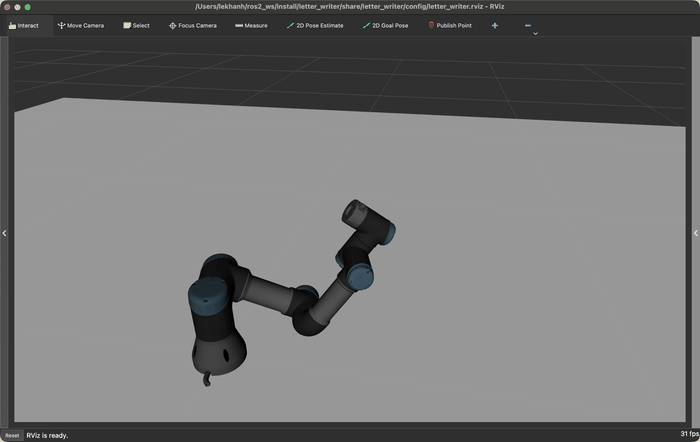
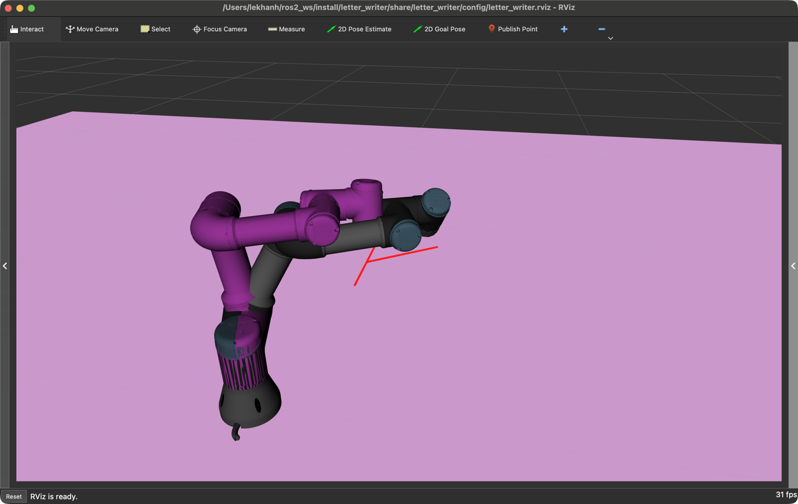
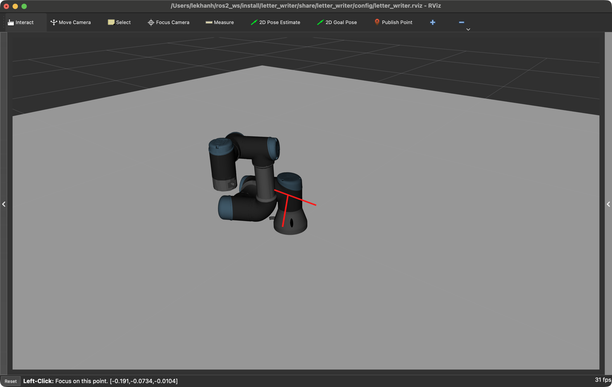

# letter_writer

ROS 2 (Humble) package that drives a UR3 robot arm to "write" the letter **K**
with its end-effector, using MoveIt 2 to plan and execute a Cartesian
trajectory in Gazebo simulation.

## Structure

- `letter_writer_node` (C++, `src/letter_writer_node.cpp`) is the only custom
  node: it builds the letter's Cartesian waypoints and drives MoveIt through
  them via `moveit::planning_interface::MoveGroupInterface`.
- The launch file starts the Gazebo simulation, MoveIt 2 (`move_group`),
  RViz, then `letter_writer_node`.
- Gazebo, ros2_control and the MoveIt configuration/SRDF are reused unmodified
  from the official Universal Robots ROS 2 packages, as the assignment
  allows.

## Trajectory

The letter is split into 3 straight-line strokes on a fixed vertical plane
(tool orientation pointing straight down):
1. **Spine** — top to bottom.
2. **Upper arm** — spine midpoint to top-right corner.
3. **Lower arm** — spine midpoint to bottom-right corner.

Between strokes the end-effector lifts, repositions, and lowers again
("pen up / move / pen down"). Geometry (origin, size, drawing height, lift
height, velocity/acceleration scaling) is exposed as ROS 2 parameters in
`config/letter_params.yaml`.

## Planning & execution

- Point-to-point moves (pen up/down) use `setPoseTarget()` + `move()` —
  joint-space OMPL (RRTConnect) planning.
- Each stroke is planned with `computeCartesianPath()` and retimed with
  `trajectory_processing::TimeOptimalTrajectoryGeneration` before being sent
  via `execute()`.
- `wrist_3_joint` has unlimited rotation, so its IK solutions across
  consecutive waypoints can differ by a full `2*pi` turn; `unwrapContinuousJoint()`
  corrects this after planning to avoid the controller spinning the wrist
  all the way around.
- Each move is wrapped in a retry loop (`withRetries()`) to absorb occasional
  simulation timing hiccups without aborting the whole letter.

## Build

```bash
mkdir -p ~/ros2_ws/src && cd ~/ros2_ws/src
git clone <this-repo-url> letter_writer

vcs import . < letter_writer/dependencies.repos
mv Universal_Robots_ROS2_Driver/ur .
mv Universal_Robots_ROS2_Driver/ur_controllers .
mv Universal_Robots_ROS2_Driver/ur_dashboard_msgs .
mv Universal_Robots_ROS2_Driver/ur_moveit_config .
rm -rf Universal_Robots_ROS2_Driver

cd ~/ros2_ws
colcon build --symlink-install
```

## Run

```bash
source ~/ros2_ws/install/setup.bash
ros2 launch letter_writer letter_writer.launch.py ur_type:=ur3
```

## Result

- Video demo: https://drive.google.com/file/d/1CPPF1sBhy7raUJDAORhDEjHkxRuJGwvf/view?usp=drive_link
- GitHub repo: https://github.com/Khanhkhan1/letter_writer



| Startup | Mid-draw (stroke 1) | Complete |
|---|---|---|
|  |  |  |
